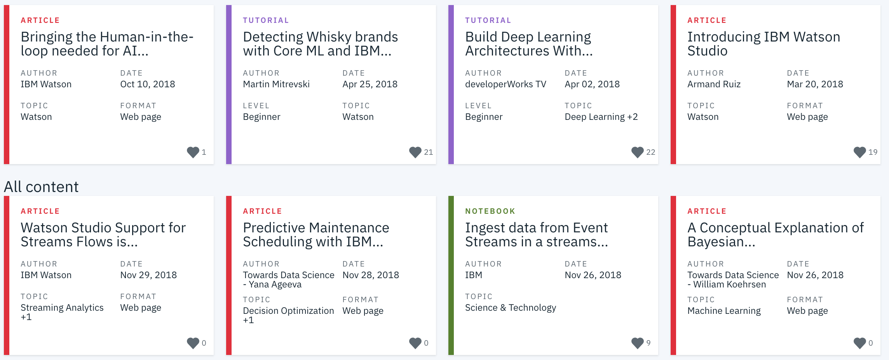

# IBM Recommendation System

## Project Overview 
IBM has an online data science community where members can post tutorials, notebooks, articles, and datasets. In this project, I analyzed user behavior and social network data on the IBM Watson platform to build a recommendation engine that recommends content most likely to be relevant to a user. I developed different recommendation models such as rank-based, user-user collaborative filtering, and matrix factorization.




## Preparing the environment
**Note**: I have developed this project on __Linux__. It can surely be run on Windows and Mac with some little changes.

1. Clone the repository, and navigate to the downloaded folder.
```
git clone https://github.com/iamirmasoud/ibm-recommendations.git
cd ibm-recommendations
```

2. Create (and activate) a new environment, named `rec_env` with Python 3.7. If prompted to proceed with the install `(Proceed [y]/n)` type y.

	```shell
	conda create -n rec_env python=3.7
	source activate rec_env
	```
	
	At this point your command line should look something like: `(rec_env) <User>:ibm-recommendations <user>$`. The `(rec_env)` indicates that your environment has been activated, and you can proceed with further package installations.

6. Before you can experiment with the code, you'll have to make sure that you have all the libraries and dependencies required to support this project. You will mainly need Python3.7+, PyTorch and its torchvision, OpenCV, Matplotlib. You can install  dependencies using:
```
pip install -r requirements.txt
```

7. Navigate back to the repo. (Also, your source environment should still be activated at this point.)
```shell
cd ibm-recommendations
```

8. Open the directory of notebooks, using the below command. You'll see all the project files appear in your local environment; open the first notebook and follow the instructions.
```shell
jupyter notebook
```

9. Once you open any of the project notebooks, make sure you are in the correct `rec_env` environment by clicking `Kernel > Change Kernel > rec_env`.


## Project Details
The project is divided into the following sections:

### I. Exploratory Data Analysis

Before making recommendations of any kind, I will  explore the data we are working with for the project. 

### II. Rank Based Recommendations

To get started in building recommendations, we will first find the most popular articles simply based on the most interactions. Since there are no ratings for any of the articles, it is easy to assume the articles with the most interactions are the most popular. These are then the articles we might recommend to new users (or anyone, depending on what we know about them).

### III. User-User Based Collaborative Filtering

In order to build better recommendations for the users of IBM's platform, we could look at users that are similar in terms of the items they have interacted with. These items could then be recommended to similar users. This would be a step in the right direction towards more personal recommendations for the users.

### IV. Content-Based Recommendations

Given the amount of content available for each article, there are a number of different ways in which someone might choose to implement a content-based recommendations system. Using NLP skills, we can come up with some extremely creative ways to develop a content-based recommendation system.

### V. Matrix Factorization

Finally, we will complete a machine learning approach to building recommendations. Using the user-item interactions, we will build out a matrix decomposition. Using the decomposition techniques, we will get an idea of how well we can predict new articles an individual might interact with. We will finally discuss which methods we might use moving forward, and how we might test how well the recommendations are working for engaging users.

## Dataset

The data is for IBM an online data science community through udacity.


### Licensing, Authors, and Acknowledgements

This project is part of Udacity [Data Scientist Nanodegree Program](https://www.udacity.com/course/data-scientist-nanodegree--nd025).

This work is licensed under a [Creative Commons Attribution-NonCommercial-NoDerivatives 4.0 International License](https://creativecommons.org/licenses/by-nc-nd/4.0/). Please refer to [Udacity Terms of Service](https://www.udacity.com/legal) for further information.

